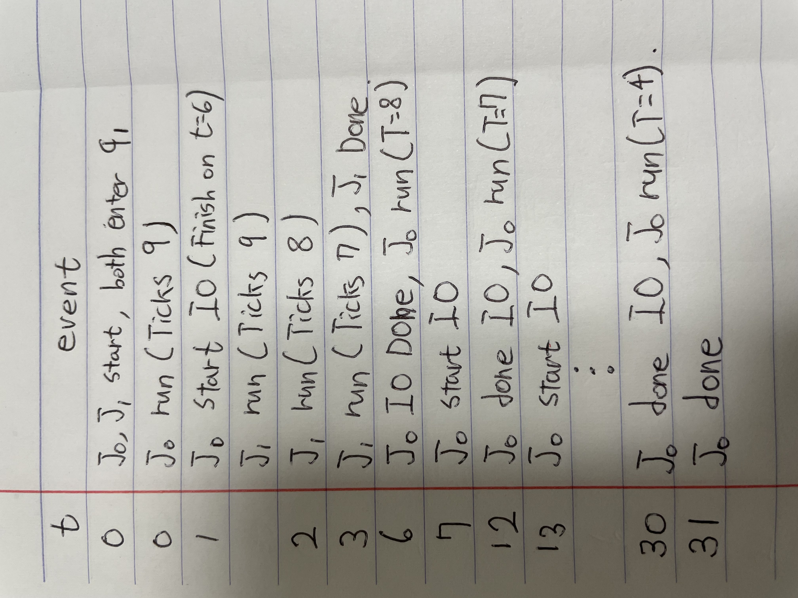
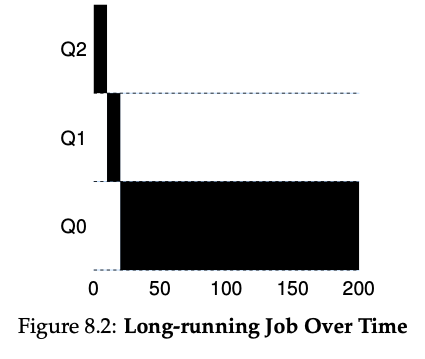
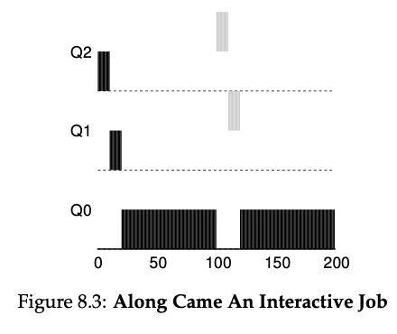
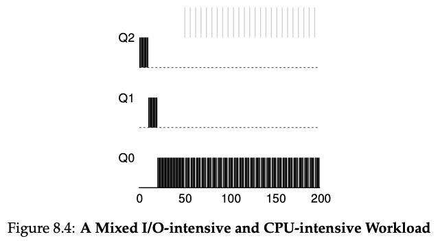
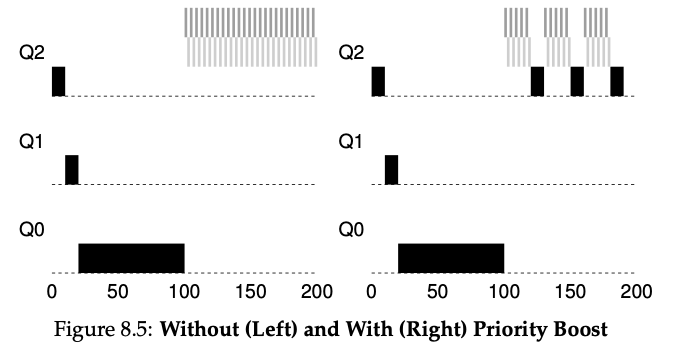
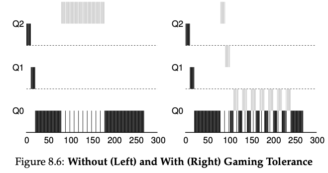
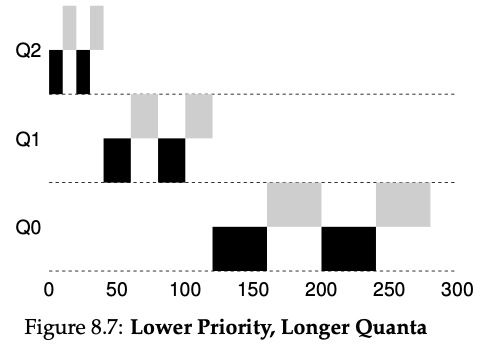

# Overview
This program, `mlfq.py`, allows you to see how the MLFQ scheduler
presented in this chapter behaves. As before, you can use this to generate
problems for yourself using random seeds, or use it to construct a
carefully-designed experiment to see how MLFQ works under different
circumstances.[link](https://github.com/remzi-arpacidusseau/ostep-homework/tree/master/cpu-sched-mlfq)

# Questions
1. Run a few randomly-generated problems with just two jobs and two queues; compute the MLFQ execution trace for each. Make your life easier by limiting the length of each job and turning off I/Os.
  
    ***Flag: -s 42 -n 2 -j 2 -m 10***
    
    ***MLFQ condition***: 
    - queues 2
    - allotments for queue  1 is   1
    - quantum length for queue  1 is  10
    - allotments for queue  0 is   1
    - quantum length for queue  0 is  10
    - boost 0
    - ioTime 5
    - stayAfterIO False
    - iobump False

    ***Job List:***
    - Job  0: startTime   0 - runTime   6 - ioFreq   1
    - Job  1: startTime   0 - runTime   3 - ioFreq   3

    ***Execution Trace*** (T=ticks left)

    
     
2. How would you run the scheduler to reproduce each of the exam- ples in the chapter?
  
    1. A Single Long-Running Job: mlfq.py -n 3 -l 0,200,0

        

    1. Along Came A Short Job: mlfq.py -n 3 -l 0,180,0:100,20,0

        

    1. A Mixed I/O intensive and CPU-intensive Workload I/O: mlfq.py -n 3 -l 0,180,0:50,20,1 --stay -c
       
        

    1. Proiority Boost: 
        
        
        - without priority boost(starvation): mlfq.py -n 3 -l 0,160,0:100,20,1:100,20,1 --stay -i 1
        - with priority boost: mlfq.py -n 3 -l 0,160,0:100,20,1:100,20,1 --stay --boost 50 -i 1

    1. Gaming Tolerance:  

        
        - without gaming tolerance: mlfq.py -n 3 -l 0,200,0:75,100,9 --stay -i 1 
        - with gaming tolerance: mlfq.py -n 3 -l 0,200,0:75,100,9 -i 1 
    
    1. Lower Priority, Longer Quanta: mlfq.py -Q 10,20,40 -l 0,150,0:0,150,0 -c

        

3. How would you configure the scheduler parameters to behave just like a round-robin scheduler?

    Use only one queue. **mlfq.py -n 1 -c**

4. Craft a workload with two jobs and scheduler parameters so that one job takes advantage of the older Rules 4a and 4b (turned on with the -S flag) to game the scheduler and obtain 99% of the CPU over a particular time interval.

    mlfq.py -n 3 -l 0,200,0:75,100,9 -S -i 1 -c. Job 1 always runs on highest priority.

5. Given a system with a quantum length of 10ms in it's highest queue, how often would you have to boost jobs back to the highest priority level (with the -B flag) in order to guarantee that a single long-running (and potentially-starving) job gets at least 5% of the CPU?

    200 ms

6. One question that arises in scheduling is which end of a queue to add a job that just finished I/O; the -I flag changes this behavior for this scheduling simulator. Play around with some workloads and see if you can see the effect of this flag.

    ***Flag:***
    
        - mlfq.py -s 42 -m 10,
        - mlfq.py -s 42 -m 10 -I

    ***Job List:***
      
        - Job  0: startTime   0 - runTime   6 - ioFreq   1
        - Job  1: startTime   0 - runTime   3 - ioFreq   3
        - Job  2: startTime   0 - runTime   7 - ioFreq   7

    ***Turnaround time:***

        - with I flag: 17.00
        - without I flag: 15.67

    With -I flag a job that finished it's I/O moved to front of the queue. This makes the average turnaround time to be shorter. Because a job that frequently makes I/O is moved to front, IDLE time is decreased.
