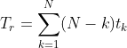
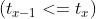

# Overview
This program, scheduler.py, allows you to see how different schedulers perform under scheduling metrics such as response time, turnaround time, and total wait time. Three schedulers are "implemented": FIFO, SJF, and RR.
[link](https://github.com/remzi-arpacidusseau/ostep-homework/tree/master/cpu-sched)
# Questions
1. Compute the response time and turnaround time when running three jobs of length 200     with the SJF and FIFO schedulers.
  - average response time

    FIFO = (0 + 200 + 400)/3 = 200

    SJF = same = 400

  - average turnaround time

    FIFO = (200 + 400 + 600)/3 = 400

    SJF = same = 400

2. Now do the same but with jobs of different lengths: 100, 200, and 300.
Assume jobs came in order (300, 200, 100)
  - average response time
    FIFO = (0 + 300 + 500)/3 = 266.67
    
    SJF = (0 + 100 + 300)/3 = 133.33
  - average turnaround time

    FIFO = (300 + 500 + 600)/3 = 466.67
  
    SJF = (100 + 300 + 600)/3 = 333.33

3. Now do the same, but also with the RR scheduler and a time-slice of 1.
  - average response time
    
    (0 + 1 + 2)/3 = 1
  
  - average turnaround time
    
    (300 + 500 + 600)/3 = 466.67

4. For what types of workloads does SJF deliver the same turnaround times as FIFO?
  
    When time length of jobs are in ascending order.

5. For what types of workloads and quantum lengths does SJF deliver the same response times as RR?
  
    When time length of jobs are in ascending order and quantum lengths are larger than every time length of jobs.

6. What happens to response time with SJF as job lengths increase? Can you use the simulator to demonstrate the trend?
  
    Total response time of running N jobs can be written as

    

     
    
    Which means shorter jobs has larger effect on total response time.

7. What happens to response time with RR as quantum lengths increase? Can you write an equation that gives the worst-case response time, given N jobs?

    Larger the quantum lengths, larger the response time. Assume response time is infinite response time is
    
    
