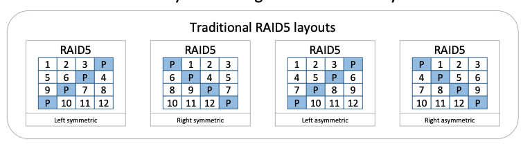

# Overview

This section introduces `raid.py`, a simple RAID simulator you can use to shore
up your knowledge of how RAID systems work. It has a number of options, as we
see below:

```sh
prompt> ./raid.py -h
Usage: raid.py [options]

Options:
  -h, --help            show this help message and exit
  -s SEED, --seed=SEED  the random seed
  -D NUMDISKS, --numDisks=NUMDISKS
                        number of disks in RAID
  -C CHUNKSIZE, --chunkSize=CHUNKSIZE
                        chunk size of the RAID
  -n NUMREQUESTS, --numRequests=NUMREQUESTS
                        number of requests to simulate
  -S SIZE, --reqSize=SIZE
                        size of requests
  -W WORKLOAD, --workload=WORKLOAD
                        either "rand" or "seq" workloads
  -w WRITEFRAC, --writeFrac=WRITEFRAC
                        write fraction (100->all writes, 0->all reads)
  -R RANGE, --randRange=RANGE
                        range of requests (when using "rand" workload)
  -L LEVEL, --level=LEVEL
                        RAID level (0, 1, 4, 5)
  -5 RAID5TYPE, --raid5=RAID5TYPE
                        RAID-5 left-symmetric "LS" or left-asym "LA"
  -r, --reverse         instead of showing logical ops, show physical
  -t, --timing          use timing mode, instead of mapping mode
  -c, --compute         compute answers for me
```

In its basic mode, you can use it to understand how the different RAID levels
map logical blocks to underlying disks and offsets. For example, let's say we
wish to see how a simple striping RAID (RAID-0) with four disks does this
mapping.[details](https://github.com/remzi-arpacidusseau/ostep-homework/tree/master/file-raid)

# Questions
1. Use the simulator to perform some basic RAID mapping tests. Run with different levels (0, 1, 4, 5) and see if you can figure out the mappings of a set of requests. For RAID-5, see if you can figure out the difference between left-symmetric and left-asymmetric layouts. Use some different random seeds to generate different problems than above.

  
  
  blockSize 4096, numDisks 4, chunkSize 4k
  ```

  python3 raid.py -L 0 -R 20 -n 5 -s 42 -w 20
  python3 raid.py -L 1 -R 20 -n 5 -s 42 -w 20
  python3 raid.py -L 4 -R 20 -n 5 -s 42 -w 20
  python3 raid.py -L 5 -R 20 -n 5 -s 42 -w 20 -5 LS
  python3 raid.py -L 5 -R 20 -n 5 -s 42 -w 20 -5 LA

  LOGICAL WRITE to  addr:12 size:4096
    raid 0: write [disk 0, offset 3]  
    raid 1: write [disk 0, offset 6], [disk 1, offset 6]  
    raid 4: read and write [disk 0, offset 4], [disk 3, offset 4]  
    raid 5(LS): read and write [disk 0, offset 4], [disk 3, offset 4]
    raid 5(LA): read and write [disk 0, offset 4], [disk 3, offset 4]

  LOGICAL READ from addr:5 size:4096
    raid 0: read  [disk 1, offset 1]  
    raid 1: read  [disk 2, offset 2]  
    raid 4: read  [disk 2, offset 1]  
    raid 5(LS): read  [disk 1, offset 1]
    raid 5(LA): read  [disk 3, offset 1]

  LOGICAL READ from addr:14 size:4096
    raid 0: read  [disk 2, offset 3]  
    raid 1: read  [disk 1, offset 7]  
    raid 4: read  [disk 2, offset 4]  
    raid 5(LS): read  [disk 2, offset 4]
    raid 5(LA): read  [disk 2, offset 4]

  LOGICAL WRITE to  addr:17 size:4096
    raid 0: write [disk 1, offset 4]  
    raid 1: write [disk 2, offset 8], [disk 3, offset 8]  
    raid 4: read and write [disk 2, offset 5], [disk 3, offset 5]  
    raid 5(LS): read and write [disk 1, offset 5], [disk 2, offset 5]
    raid 5(LA): read and write [disk 3, offset 5], [disk 2, offset 5]

  LOGICAL WRITE to  addr:8 size:4096
    raid 0: write [disk 0, offset 2] 
    raid 1: write [disk 0, offset 4], [disk 1, offset 4] 
    raid 4: read and write [disk 2, offset 2], [disk 3, offset 2]  
    raid 5(LS): read and write [disk 0, offset 2], [disk 1, offset 2]
    raid 5(LA): read and write [disk 3, offset 2], [disk 1, offset 2]

  ```
2. Do the same as the first problem, but this time vary the chunk size with -C. How does chunk size change the mappings?
  
  ```
  python3 raid.py -L 0 -R 20 -n 5 -s 42 -w 20 -C 8k
  python3 raid.py -L 1 -R 20 -n 5 -s 42 -w 20 -C 8k
  python3 raid.py -L 4 -R 20 -n 5 -s 42 -w 20 -C 8k
  python3 raid.py -L 5 -R 20 -n 5 -s 42 -w 20 -5 LS -C 8k
  python3 raid.py -L 5 -R 20 -n 5 -s 42 -w 20 -5 LA -C 8k

  LOGICAL WRITE to  addr:12 size:4096
    raid 0: write [disk 2, offset 2]  
    raid 1: write [disk 0, offset 6], [disk 1, offset 6]  
    raid 4: read and write [disk 0, offset 4], [disk 3, offset 4]  
    raid 5(LS): read and write [disk 2, offset 4], [disk 1, offset 4]
    raid 5(LA): read and write [disk 0, offset 4], [disk 1, offset 4]

  LOGICAL READ from addr:5 size:4096
    raid 0: read  [disk 2, offset 1]  
    raid 1: read  [disk 1, offset 3]  
    raid 4: read  [disk 2, offset 1]  
    raid 5(LS): read  [disk 2, offset 1]
    raid 5(LA): read  [disk 2, offset 1]

  LOGICAL READ from addr:14 size:4096
    raid 0: read  [disk 3, offset 2]  
    raid 1: read  [disk 2, offset 6]  
    raid 4: read  [disk 1, offset 4]  
    raid 5(LS): read  [disk 3, offset 4]
    raid 5(LA): read  [disk 2, offset 4]

  LOGICAL WRITE to  addr:17 size:4096
    raid 0: write [disk 0, offset 5]  
    raid 1: write [disk 0, offset 9], [disk 1, offset 9]  
    raid 4: read and write [disk 2, offset 5], [disk 3, offset 5]  
    raid 5(LS): read and write [disk 0, offset 5], [disk 1, offset 5]
    raid 5(LA): read and write [disk 3, offset 5], [disk 1, offset 5]

  LOGICAL WRITE to  addr:8 size:4096
    raid 0: write [disk 0, offset 2] 
    raid 1: write [disk 0, offset 4], [disk 1, offset 4] 
    raid 4: read and write [disk 1, offset 2], [disk 3, offset 2]  
    raid 5(LS): read and write [disk 0, offset 2], [disk 2, offset 2]
    raid 5(LA): read and write [disk 1, offset 2], [disk 2, offset 2]
  ```
3. Do the same as above, but use the -r flag to reverse the nature of each problem.

4. Now use the reverse flag but increase the size of each request with the -S flag. Try specifying sizes of 8k, 12k, and 16k, while varying the RAID level. What happens to the underlying I/O pattern when the size of the request increases? Make sure to try this with the sequential workload too (-W sequential); for what request sizes are RAID-4 and RAID-5 much more I/O efficient?

  RAID-4 and RAID-5 much more I/O efficient for chunk size of 16k. Because the sequential read/write is made on both data and parity disk.

  ```
  python3 raid.py -L 5 -R 20 -n 5 -w 100 -5 LA -C 16k -r -c -W sequential

  0 1
  LOGICAL WRITE to  addr:0 size:4096
    read  [disk 0, offset 0]    read  [disk 3, offset 0]  
    write [disk 0, offset 0]    write [disk 3, offset 0]  

  1 1
  LOGICAL WRITE to  addr:1 size:4096
    read  [disk 0, offset 1]    read  [disk 3, offset 1]  
    write [disk 0, offset 1]    write [disk 3, offset 1]  

  2 1
  LOGICAL WRITE to  addr:2 size:4096
    read  [disk 0, offset 2]    read  [disk 3, offset 2]  
    write [disk 0, offset 2]    write [disk 3, offset 2]  

  3 1
  LOGICAL WRITE to  addr:3 size:4096
    read  [disk 0, offset 3]    read  [disk 3, offset 3]  
    write [disk 0, offset 3]    write [disk 3, offset 3]  

  4 1
  LOGICAL WRITE to  addr:4 size:4096
    read  [disk 1, offset 0]    read  [disk 3, offset 0]  
    write [disk 1, offset 0]    write [disk 3, offset 0]
  ```
  
5. Use the timing mode of the simulator (-t) to estimate the performance of 100 random reads to the RAID, while varying the RAID levels, using 4 disks.

  Throughput of random read is N * R for raid-0,1,5, (N-1) * R for raid-4.

  ```
  python3 raid.py -t -n 100 -D 4 -s 42 -L 0 -c

  disk:0  busy:  59.08  I/Os:    21 (sequential:0 nearly:3 random:18)
  disk:1  busy:  80.53  I/Os:    27 (sequential:0 nearly:1 random:26)
  disk:2  busy: 100.00  I/Os:    34 (sequential:0 nearly:2 random:32)
  disk:3  busy:  52.99  I/Os:    18 (sequential:0 nearly:1 random:17)

  STAT totalTime 333.30000000000007

  python3 raid.py -t -n 100 -D 4 -s 42 -L 1 -c

  disk:0  busy:  61.56  I/Os:    21 (sequential:0 nearly:2 random:19)
  disk:1  busy: 100.00  I/Os:    34 (sequential:0 nearly:1 random:33)
  disk:2  busy:  81.38  I/Os:    27 (sequential:0 nearly:0 random:27)
  disk:3  busy:  54.16  I/Os:    18 (sequential:0 nearly:1 random:17)

  STAT totalTime 335.1000000000001

  python3 raid.py -t -n 100 -D 4 -s 42 -L 4 -c

  disk:0  busy:  63.37  I/Os:    28 (sequential:0 nearly:4 random:24)
  disk:1  busy: 100.00  I/Os:    40 (sequential:0 nearly:0 random:40)
  disk:2  busy:  75.97  I/Os:    32 (sequential:0 nearly:3 random:29)
  disk:3  busy:   0.00  I/Os:     0 (sequential:0 nearly:0 random:0)

  STAT totalTime 404.0000000000002  

  python3 raid.py -t -n 100 -D 4 -s 42 -L 5 -c

  disk:0  busy:  60.27  I/Os:    21 (sequential:0 nearly:2 random:19)
  disk:1  busy:  80.81  I/Os:    27 (sequential:0 nearly:1 random:26)
  disk:2  busy: 100.00  I/Os:    34 (sequential:0 nearly:1 random:33)
  disk:3  busy:  53.30  I/Os:    18 (sequential:0 nearly:1 random:17)

  STAT totalTime 334.50000000000006
  ```
6. Do the same as above, but increase the number of disks. How does the performance of each RAID level scale as the number of disks increases?

  ```
  python3 raid.py -t -n 100 -D 8 -s 42 -L 0 -c: totalTime 230.19999999999996
  python3 raid.py -t -n 100 -D 8 -s 42 -L 1 -c: totalTime 237.09999999999994
  python3 raid.py -t -n 100 -D 8 -s 42 -L 4 -c: totalTime 192.09999999999994
  python3 raid.py -t -n 100 -D 8 -s 42 -L 5 -c: totalTime 233.09999999999994
  ```

7. Do the same as above, but use all writes (-w 100) instead of reads. How does the performance of each RAID level scale now? Can you do a rough estimate of the time it will take to complete the workload of 100 random writes?

  ```
  python3 raid.py -t -n 100 -D 4 -s 42 -w 100 -L 0 -c

  disk:0  busy:  59.08  I/Os:    21 (sequential:0 nearly:3 random:18)
  disk:1  busy:  80.53  I/Os:    27 (sequential:0 nearly:1 random:26)
  disk:2  busy: 100.00  I/Os:    34 (sequential:0 nearly:2 random:32)
  disk:3  busy:  52.99  I/Os:    18 (sequential:0 nearly:1 random:17)

  STAT totalTime 333.30000000000007

  python3 raid.py -t -n 100 -D 4 -s 42 -w 100 -L 1 -c

  disk:0  busy: 100.00  I/Os:    55 (sequential:0 nearly:3 random:52)
  disk:1  busy: 100.00  I/Os:    55 (sequential:0 nearly:3 random:52)
  disk:2  busy:  83.95  I/Os:    45 (sequential:0 nearly:0 random:45)
  disk:3  busy:  83.95  I/Os:    45 (sequential:0 nearly:0 random:45)

  STAT totalTime 541.4000000000004

  python3 raid.py -t -n 100 -D 4 -s 42 -w 100 -L 4 -c

  disk:0  busy:  26.47  I/Os:    56 (sequential:0 nearly:32 random:24)
  disk:1  busy:  41.77  I/Os:    80 (sequential:0 nearly:40 random:40)
  disk:2  busy:  31.73  I/Os:    64 (sequential:0 nearly:35 random:29)
  disk:3  busy: 100.00  I/Os:   200 (sequential:0 nearly:110 random:90)

  STAT totalTime 967.3000000000012

  python3 raid.py -t -n 100 -D 4 -s 42 -w 100 -L 5 -c

  disk:0  busy:  72.86  I/Os:    84 (sequential:0 nearly:46 random:38)
  disk:1  busy: 100.00  I/Os:   112 (sequential:0 nearly:59 random:53)
  disk:2  busy:  98.89  I/Os:   112 (sequential:0 nearly:61 random:51)
  disk:3  busy:  82.44  I/Os:    92 (sequential:0 nearly:49 random:43)

  STAT totalTime 549.1000000000005
  ```

8. Run the timing mode one last time, but this time with a sequential workload (-W sequential). How does the performance vary with RAID level, and when doing reads versus writes? How about when varying the size of each request? What size should you write to a RAID when using RAID-4 or RAID-5?

  ```
  python3 raid.py -t -n 100 -D 4 -s 42 -W sequential -L 0 -c: totalTime 12.499999999999991
  python3 raid.py -t -n 100 -D 4 -s 42 -W sequential -L 1 -c: totalTime 14.899999999999983
  python3 raid.py -t -n 100 -D 4 -s 42 -W sequential -L 4 -c: totalTime 13.399999999999988
  python3 raid.py -t -n 100 -D 4 -s 42 -W sequential -L 5 -c: totalTime 13.299999999999988

  python3 raid.py -t -n 100 -D 4 -s 42 -W sequential -L 0 -w 100 -c: totalTime 12.499999999999991
  python3 raid.py -t -n 100 -D 4 -s 42 -W sequential -L 1 -w 100 -c: totalTime 14.999999999999982
  python3 raid.py -t -n 100 -D 4 -s 42 -W sequential -L 4 -w 100 -c: totalTime 13.399999999999988
  python3 raid.py -t -n 100 -D 4 -s 42 -W sequential -L 5 -w 100 -c: totalTime 13.399999999999988
  ```